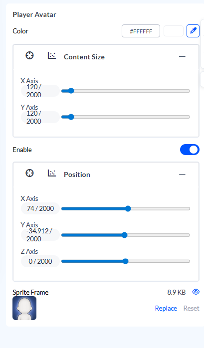

# UI Layer Parameters

**The UI Layer is included at no extra cost.** Every visual component in your dashboard can be customized instantly — no approval required.

<figure><figcaption>UI Layer controls visual appearance — images, text, colors, buttons</figcaption></figure>

---

## What is the UI Layer?

The UI Layer controls how things **look** — images, text, colors, buttons, visibility. Changes apply instantly in the dashboard preview. This layer is **auto-scanned** from your playable's Canvas hierarchy.

| ComponentParameter | Cocos Component | What It Controls |
|--------------------|-----------------|------------------|
| SpriteComponentParameter | `cc.Sprite` | Images, icons, backgrounds, tint colors |
| LabelComponentParameter | `cc.Label` | Text content, fonts, colors, outline, shadow |
| ButtonComponentParameter | `cc.Button` | Interactive buttons with transitions and states |
| UIOpacityComponentParameter | `cc.UIOpacity` | Transparency and fade effects |
| TransformComponentParameter | `cc.Node` | Position, rotation, scale |
| WidgetComponentParameter | `cc.Widget` | Anchoring and alignment |
| ProgressBarComponentParameter | `cc.ProgressBar` | Progress indicators |
| SliderComponentParameter | `cc.Slider` | Slider controls |
| ToggleComponentParameter | `cc.Toggle` | Checkbox/toggle states |
| LayoutComponentParameter | `cc.Layout` | Auto-layout settings |
| MaskComponentParameter | `cc.Mask` | Masking effects |
| CameraComponentParameter | `cc.Camera` | Camera position, FOV |

---

## SpriteParameter

Controls any image element attached to a `cc.Sprite` component.

<figure><figcaption>SpriteParameter properties: spriteFrame, spriteColor, position, scale</figcaption></figure>

### Properties (ALL fields included by default)

| Property | Config Key | Type | Description |
|----------|------------|------|-------------|
| `enable` | `enable` | BooleanParameter | Show or hide node |
| `position` | `position: {x, y}` | CoordinatesParameter | 2D screen position |
| `contentSize` | `contentSize: {x, y}` | CoordinatesParameter | Width and height |
| `scale` | `scale: {x, y}` | CoordinatesParameter | Size multiplier |
| `spriteFrame` | `spriteFrame: ""` | ImageParameter | Image asset (PNG/JPG) |
| `color` | `spriteColor: "#FFFFFF"` | ColorParameter | Tint color overlay |

### spriteFrame

Upload or replace the image.

| Requirement | Value |
|-------------|-------|
| Format | PNG (transparent) or JPG |
| Max size | 2MB |
| Recommended | 512x512 for icons, 1920x1080 for backgrounds |

### spriteColor

Tint overlay applied to the image.

| Value | Effect |
|-------|--------|
| `#FFFFFF` | No tint (original colors) |
| `#FF0000` | Red tint |
| `#00000080` | 50% black overlay (darken) |

### position

Screen coordinates from the node's anchor point.

```
{x: 0, y: 0}      → Center (if anchor is 0.5, 0.5)
{x: -200, y: 100} → 200px left, 100px up from center
```

### scale

Size multiplier. `{x: 1, y: 1}` = original size.

```
{x: 2, y: 2}    → 2x larger
{x: 0.5, y: 0.5} → Half size
{x: 1.5, y: 1}  → Stretched horizontally
```

---

## LabelParameter

Controls any text element attached to a `cc.Label` component.

<figure><figcaption>LabelParameter properties: string, labelColor, fontSize, outline, shadow</figcaption></figure>

### Properties (ALL fields included by default)

| Property | Config Key | Type | Description |
|----------|------------|------|-------------|
| `enable` | `enable` | BooleanParameter | Show or hide |
| `position` | `position: {x, y}` | CoordinatesParameter | 2D screen position |
| `contentSize` | `contentSize: {x, y}` | CoordinatesParameter | Text box size |
| `string` | `string: "text"` | TextParameter | Display text content |
| `color` | `labelColor: "#FFFFFF"` | ColorParameter | Text fill color |
| `fontSize` | `fontSize: 48` | NumberParameter | Font size in pixels |
| `lineHeight` | `lineHeight: 0` | NumberParameter | Line spacing (0 = auto) |
| `isBold` | `isBold: false` | BooleanParameter | Bold style |
| `isItalic` | `isItalic: false` | BooleanParameter | Italic style |
| `isUnderline` | `isUnderline: false` | BooleanParameter | Underline decoration |
| `outlineColor` | `outlineColor: "#000000"` | ColorParameter | Text outline color |
| `outlineWidth` | `outlineWidth: 0` | NumberParameter | Outline thickness (0 = none) |
| `shadowColor` | `shadowColor: "#000000"` | ColorParameter | Drop shadow color |
| `shadowOffset` | `shadowOffset: {x, y}` | CoordinatesParameter | Shadow offset position |

### string

The text content displayed.

```
"Download Now"
"Level 1"
"Score: "
```

### labelColor

Text fill color in hex format.

| Format | Example |
|--------|---------|
| Solid | `#FFFFFF` |
| With alpha | `#FFFFFF80` (50% transparent) |

### fontSize

Font size in pixels. Typical values:

| Use Case | Size |
|----------|------|
| Headlines | 60-80 |
| Body text | 36-48 |
| Labels | 24-32 |
| Small text | 18-24 |

### Outline

Text outline for readability against busy backgrounds.

<figure><figcaption>Outline width: 0 (none), 2 (thin), 4 (thick)</figcaption></figure>

| Property | Value | Effect |
|----------|-------|--------|
| `outlineColor` | `#000000` | Black outline |
| `outlineWidth` | `0` | No outline |
| `outlineWidth` | `2` | Thin outline |
| `outlineWidth` | `4` | Thick outline |

### Shadow

Drop shadow for depth.

| Property | Value | Effect |
|----------|-------|--------|
| `shadowColor` | `#000000` | Black shadow |
| `shadowOffset` | `{x: 2, y: -2}` | Bottom-right shadow |
| `shadowOffset` | `{x: 0, y: 0}` | No shadow |

---

## ButtonParameter

Controls interactive buttons. Extends `SpriteParameter` with label prefix fields.

<figure><figcaption>ButtonParameter: spriteFrame (background) + labelString, labelColor, labelFontSize (text)</figcaption></figure>

### Sprite Properties (Button Background)

Inherits ALL SpriteParameter fields:

| Property | Config Key | Type | Description |
|----------|------------|------|-------------|
| `enable` | `enable` | BooleanParameter | Show or hide |
| `position` | `position: {x, y}` | CoordinatesParameter | Button position |
| `contentSize` | `contentSize: {x, y}` | CoordinatesParameter | Button dimensions |
| `scale` | `scale: {x, y}` | CoordinatesParameter | Size multiplier |
| `spriteFrame` | `spriteFrame` | ImageParameter | Button background image |
| `color` | `spriteColor` | ColorParameter | Background tint |

### Label Properties (Button Text)

Additional label prefix fields:

| Property | Config Key | Type | Description |
|----------|------------|------|-------------|
| `labelString` | `string: "Play"` | TextParameter | Button text |
| `labelColor` | `labelColor: "#FFFFFF"` | ColorParameter | Text color |
| `labelFontSize` | `fontSize: 36` | NumberParameter | Text size |
| `labelLineHeight` | `lineHeight: 0` | NumberParameter | Line spacing |
| `labelBold` | `isBold: false` | BooleanParameter | Bold style |
| `labelOutlineColor` | `outlineColor: "#000"` | ColorParameter | Text outline |
| `labelOutlineWidth` | `outlineWidth: 0` | NumberParameter | Outline thickness |

---

## TransformComponentParameter

Maps to `cc.Node`. Base transform properties for any scene node.

### Properties

| Property | Config Key | Type | Description |
|----------|------------|------|-------------|
| `position` | `position: {x, y}` or `{x, y, z}` | CoordinatesParameter | Node position |
| `rotation` | `rotation: {x, y, z}` | CoordinatesParameter | Rotation in degrees |
| `scale` | `scale: {x, y}` | CoordinatesParameter | Size multiplier |

---

## UINodeParameter

Base properties for UI nodes (extends TransformComponentParameter).

### Properties

| Property | Config Key | Type | Description |
|----------|------------|------|-------------|
| `enable` | `enable` | BooleanParameter | Show or hide |
| `position` | `position: {x, y}` | CoordinatesParameter | 2D position |
| `scale` | `scale: {x, y}` | CoordinatesParameter | Scale factor |
| `contentSize` | `contentSize: {x, y}` | CoordinatesParameter | Width and height |

---

## CameraComponentParameter

Maps to `cc.Camera`. Controls camera nodes.

### Properties

| Property | Config Key | Type | Description |
|----------|------------|------|-------------|
| `position` | `position: {x, y, z}` | CoordinatesParameter | Camera position |
| `rotation` | `rotation: {x, y, z}` | CoordinatesParameter | Camera rotation |
| `fov` | `fov: 45` | NumberParameter | Field of view (degrees) |

---

## UIOpacityComponentParameter

Maps to `cc.UIOpacity`. Controls transparency.

### Properties

| Property | Config Key | Type | Description |
|----------|------------|------|-------------|
| `opacity` | `opacity: 255` | NumberParameter | Opacity 0-255 |

---

## WidgetComponentParameter

Maps to `cc.Widget`. Controls anchoring and alignment.

### Properties

| Property | Config Key | Type | Description |
|----------|------------|------|-------------|
| `top` | `top` | NumberParameter | Top anchor distance |
| `bottom` | `bottom` | NumberParameter | Bottom anchor distance |
| `left` | `left` | NumberParameter | Left anchor distance |
| `right` | `right` | NumberParameter | Right anchor distance |
| `alignMode` | `alignMode` | SelectParameter | Alignment mode |

---

## ProgressBarComponentParameter

Maps to `cc.ProgressBar`. Controls progress indicators.

<figure><figcaption>ProgressBar: background, fill bar, progress value 0-1</figcaption></figure>

### Properties

| Property | Config Key | Type | Description |
|----------|------------|------|-------------|
| `mode` | `mode` | SelectParameter | Bar mode (horizontal/vertical) |
| `totalLength` | `totalLength` | NumberParameter | Bar length |
| `progress` | `progress: 0.5` | NumberParameter | Progress value 0-1 |
| `reverse` | `reverse: false` | BooleanParameter | Reverse direction |

---

## SliderComponentParameter

Maps to `cc.Slider`. Controls slider inputs.

<figure><figcaption>Slider: track, handle, direction indicator</figcaption></figure>

### Properties

| Property | Config Key | Type | Description |
|----------|------------|------|-------------|
| `direction` | `direction` | SelectParameter | Slider direction |
| `progress` | `progress: 0.5` | NumberParameter | Slider value 0-1 |

---

## ToggleComponentParameter

Maps to `cc.Toggle`. Controls checkbox/toggle states.

<figure><figcaption>Toggle: checked state, unchecked state, checkmark sprite</figcaption></figure>

### Properties

| Property | Config Key | Type | Description |
|----------|------------|------|-------------|
| `isChecked` | `isChecked: true` | BooleanParameter | Checked state |
| `interactable` | `interactable: true` | BooleanParameter | Can interact |

---

## ColorParameter

Standalone color value.

<figure><figcaption>Hex format: #RRGGBB (solid) or #RRGGBBAA (with alpha)</figcaption></figure>

### Format

| Format | Example | Notes |
|--------|---------|-------|
| Hex (solid) | `#FF5722` | Full opacity |
| Hex (alpha) | `#FF572280` | 50% opacity (80 hex = 128/255) |

### Alpha Values

| Hex | Decimal | Opacity |
|-----|---------|---------|
| `FF` | 255 | 100% |
| `CC` | 204 | 80% |
| `80` | 128 | 50% |
| `40` | 64 | 25% |
| `00` | 0 | 0% |

---

## CoordinatesParameter

2D or 3D point values.

### 2D (UI elements)

```
{x: 0, y: 0}
{x: 100, y: -50}
```

### 3D (3D objects, cameras)

```
{x: 0, y: 0, z: 0}
{x: 10, y: 5, z: -20}
```

---

## Base Parameter Types

These primitive types are used within ComponentParameters:

| Type | Input | Example |
|------|-------|---------|
| `ImageParameter` | File upload | PNG/JPG |
| `TextParameter` | Text field | `"Download Now"` |
| `ColorParameter` | Color picker | `#FF5722` or `#FF572280` (with alpha) |
| `NumberParameter` | Number input | `48` |
| `BooleanParameter` | Toggle | `true` / `false` |
| `CoordinatesParameter` | X/Y inputs | `{x: 0, y: 100}` or `{x, y, z}` |
| `RangeParameter` | Slider | `0.5` (bounded min-max) |
| `SelectParameter` | Dropdown | `"option1"` |
| `ObjectParameter<T>` | Grouped fields | Composite bundling |

---

## NodePreset Catalog

Pre-built presets for common UI patterns (auto-detected during scan):

| Preset | Components | Use Case |
|--------|------------|----------|
| Button | Node + UITransform + Sprite + Label + Button + UIOpacity | CTA buttons |
| Image | Node + UITransform + Sprite + UIOpacity | Backgrounds, icons |
| Text | Node + UITransform + Label + UIOpacity | Titles, descriptions |
| Slider | Node + UITransform + Sprite + Slider + UIOpacity | Settings sliders |
| Toggle | Node + UITransform + Sprite + Toggle + UIOpacity | Checkboxes |
| CurrencyUI | Node(root) + Node(icon) + Label(counter) | Currency displays (coins, gems) |
| HPBar | Node(root) + Sprite(bg) + Sprite(fill) + Label(text)? | Health/progress bars |
| Countdown | Node(root) + Label(prep) + Label(number) | Countdown timers |
| IconLabel | Node(root) + Sprite(icon) + Label(text) | Icon + text combos (score, lives) |

---

## Animation Presets

Animation presets add visual polish to UI elements. Used for tutorial hands, text entrances, button feedback.

<figure><figcaption>Animation presets: Entrance (appear), Exit (disappear), Emphasis (attention), Interactive (gestures)</figcaption></figure>

### Entrance Animations

| Preset | Description |
|--------|-------------|
| `fadeIn` | Opacity 0 → 1 |
| `scaleUp` | Scale from 0 → 1 |
| `slideInLeft` | Slide from off-screen left |
| `slideInRight` | Slide from off-screen right |
| `slideInTop` | Slide from off-screen top |
| `slideInBottom` | Slide from off-screen bottom |
| `bounceIn` | Scale with bounce easing |
| `pop` | Quick scale overshoot then settle |

### Exit Animations

| Preset | Description |
|--------|-------------|
| `fadeOut` | Opacity 1 → 0 |
| `scaleDown` | Scale from 1 → 0 |
| `slideOutLeft` | Slide to off-screen left |
| `slideOutRight` | Slide to off-screen right |
| `slideOutTop` | Slide to off-screen top |
| `slideOutBottom` | Slide to off-screen bottom |
| `shrink` | Scale down and fade |

### Emphasis Animations

| Preset | Description |
|--------|-------------|
| `pulse` | Scale up/down rhythmically |
| `shake` | Horizontal shake |
| `bounce` | Vertical bounce |
| `wiggle` | Rotation wiggle |
| `glow` | Brightness pulse |
| `heartbeat` | Double-pulse scale |

### Interactive Animations

| Preset | Description |
|--------|-------------|
| `tap` | Tap/press motion (tutorial hand) |
| `press` | Press and release |
| `swipe` | Swipe gesture motion |
| `drag` | Drag motion |

---

## Related

- [Config Layer](config-layer.md) — Gameplay values (HP, timers, speed)
- [File Formats](../reference/file-formats.md) — Image specifications
